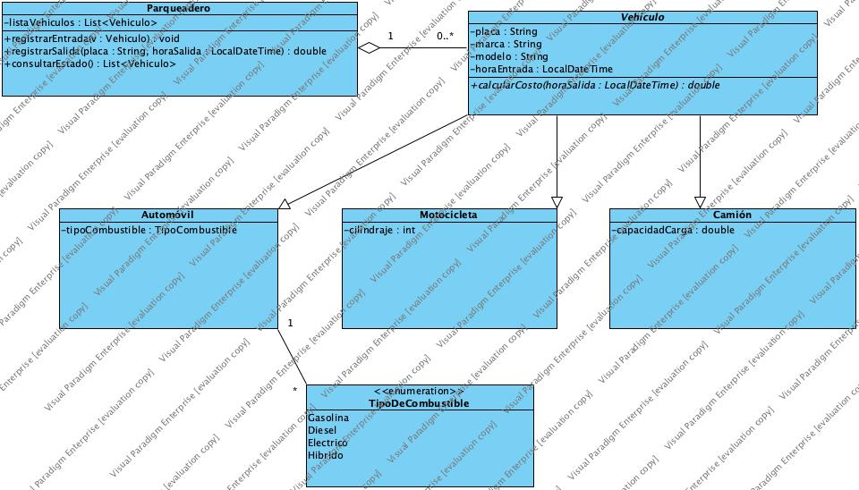

# Parqueadero App

Aplicación Java desarrollada en NetBeans para la gestión de entradas y salidas de vehículos en un parqueadero, calculando el valor a cobrar según el tipo de vehículo y tiempo de permanencia.

## Descripción

Este proyecto implementa un sistema de parqueadero usando **Programación Orientada a Objetos** en Java, con:
- Uso de **clases abstractas** (`Vehiculo`) y **herencia** (`Automovil`, `Motocicleta`, `Camion`).
- Implementación de un **enum** (`TipoCombustible`) para el manejo de tipos de combustible.
- Registro de entrada y salida con fechas y horas (`LocalDateTime`).
- Cálculo automático del cobro por tiempo.

## Tecnologías Utilizadas

- **Java** 8+
- **Apache Maven**
- **NetBeans IDE** 12+
- **Git** / **GitHub** para control de versiones

##  Diagrama de Clases
